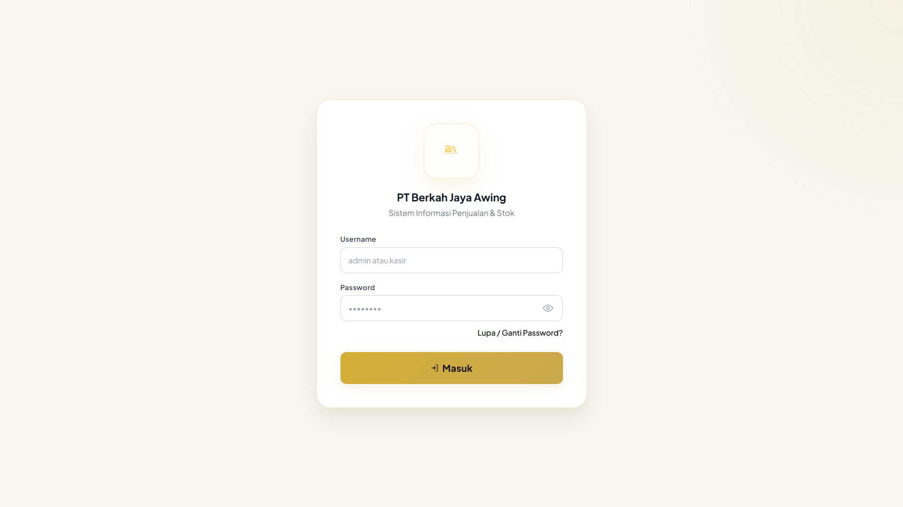
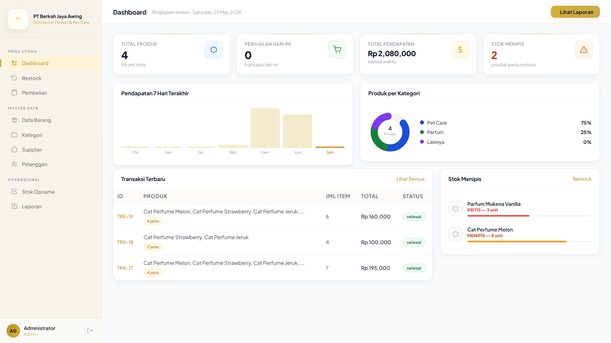
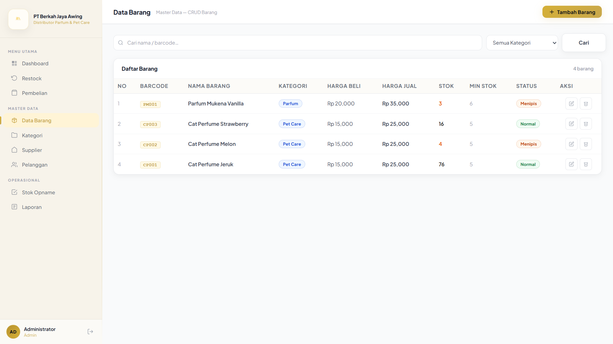
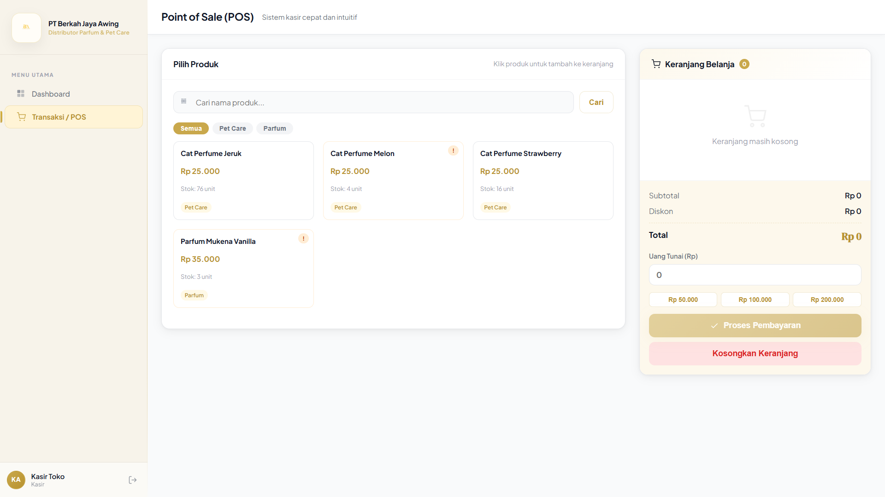
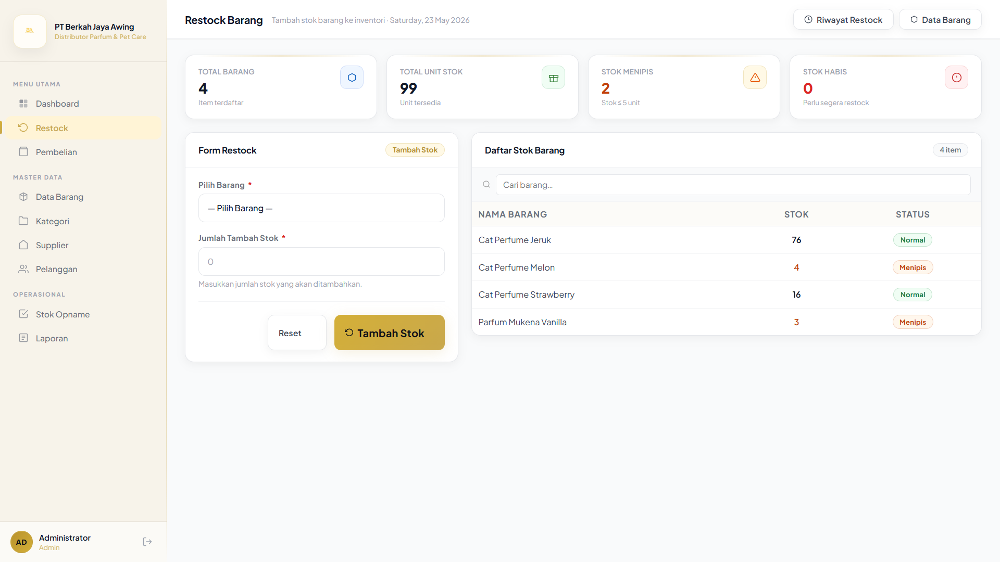
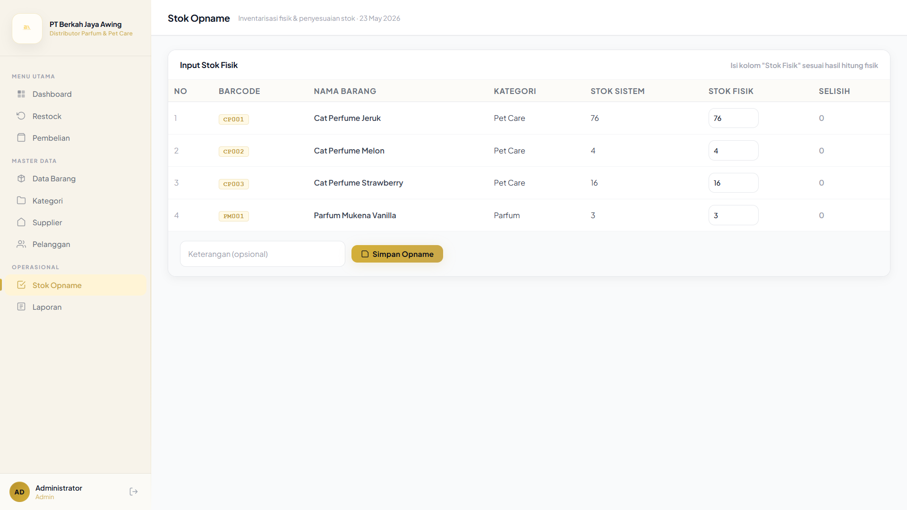
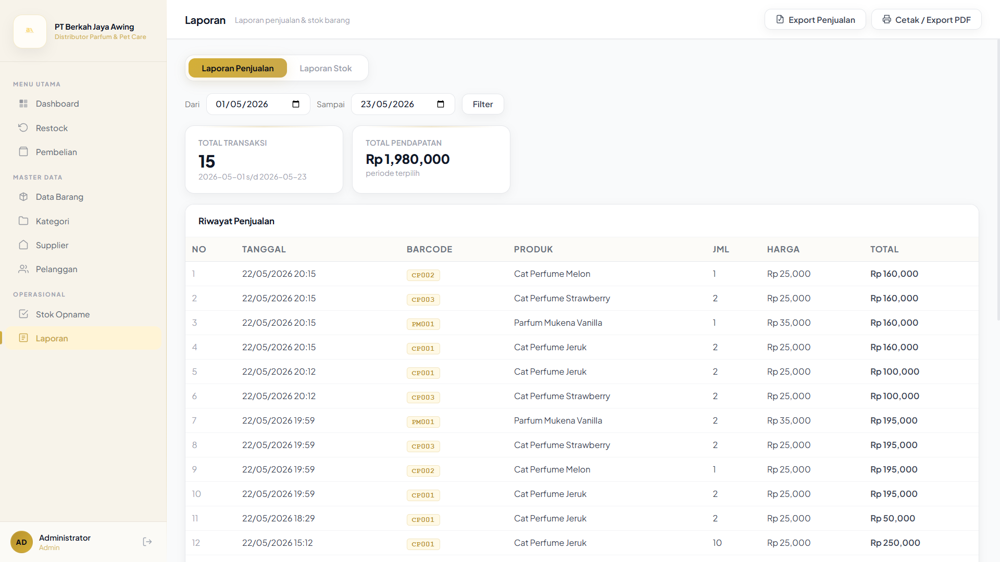

# 🛒 Sistem Penjualan dan Stok Opname


Sistem Penjualan dan Stok Opname berbasis web yang dikembangkan sebagai proyek **Kerja Praktek (KP)**. Sistem ini membantu proses pengelolaan penjualan, manajemen stok, restock barang, serta stok opname secara real-time.

## 📑 Daftar Isi
- [Status Project](#-status-project)
- [Fitur Utama](#-fitur-utama)
- [Informasi Proyek](#-informasi-proyek)
- [Struktur Folder](#-struktur-folder)
- [Cara Menjalankan](#️-cara-menjalankan-project)
- [Teknologi](#-teknologi)
- [Preview Sistem](#-preview-sistem)
- [Pengembang](#-pengembang)
- [Lisensi](#-lisensi)

## 🚀 Status Project
✅ **Completed**

Project ini dikembangkan sebagai proyek Kerja Praktek (KP) dan seluruh fitur utama telah selesai diimplementasikan.

---

## 📌 Informasi Proyek
- **Nama Proyek** : Sistem Penjualan dan Stok Opname
- **Jenis** : Web Application
- **Bahasa Pemrograman** : PHP Native
- **Database** : MySQL
- **Frontend** : HTML, CSS, JavaScript
- **Web Server** : Apache (XAMPP / Laragon / Docker)

---

## ✨ Fitur Utama

### 🔐 Autentikasi
- Login Multi User (Admin & Kasir)
- Logout
- Ganti Password

### 📦 Master Data
- CRUD Barang
- CRUD Kategori
- CRUD Supplier
- CRUD Pelanggan

### 💳 Point of Sale (POS)
- Transaksi Penjualan
- Perhitungan Total & Kembalian Otomatis
- Pengurangan Stok Otomatis
- Export Data Penjualan

### 📊 Manajemen Stok
- Restock Barang
- Riwayat Restock
- Stock Opname
- Riwayat Stock Opname
- Notifikasi Stok Minimum

### 📈 Laporan
- Laporan Penjualan
- Laporan Stok Barang
- Export Laporan ke Excel

---

## 🗂 Struktur Folder
```bash
SistemPenjualan/
├── css/
├── img/
│   └── produk/
├── js/
├── backup/
├── barang.php
├── dashboard.php
├── dashboard_kasir.php
├── kategori.php
├── supplier.php
├── pelanggan.php
├── transaksi.php
├── laporan.php
├── stock_opname.php
├── restock.php
├── login.php
├── logout.php
├── koneksi.php
└── sistem_penjualan.sql
```

---

## ⚙️ Cara Menjalankan Project

### 🐳 Dengan Docker (Optional)

1. Pastikan **Docker Desktop** sudah terinstal.
2. Jalankan perintah:
   ```bash
   docker compose up -d
   ```
3. Buka phpMyAdmin di `http://localhost:8081`
4. Import database `sistem_penjualan.sql`
5. Akses aplikasi di `http://localhost:8080`

### 🛠️ Dengan XAMPP (Manual)

1. **Clone atau Download Project**
   ```bash
   git clone https://github.com/FerdiGeasil/sistem-penjualan-stok-opname.git
   ```

2. **Pindahkan Folder**
   Masukkan folder project ke dalam `xampp/htdocs/`

3. **Import Database**
   - Buka **phpMyAdmin**
   - Buat database baru bernama `sistem_penjualan`
   - Import file `sistem_penjualan.sql`

4. **Konfigurasi Koneksi**
   Edit file `koneksi.php`:
   ```php
   $conn = mysqli_connect("localhost", "root", "", "sistem_penjualan");
   ```

5. **Jalankan XAMPP**
   Nyalakan **Apache** dan **MySQL**

6. **Akses Aplikasi**
   Buka browser: `http://localhost/SistemPenjualan/`

---

## 🛠 Teknologi
- **Backend** : PHP Native
- **Database** : MySQL
- **Frontend** : HTML5, CSS3, JavaScript
- **Server** : Apache
- **Tools** : XAMPP, Docker, phpMyAdmin

---

## 📄 Lisensi
Project ini dibuat untuk keperluan **pembelajaran** dan **Kerja Praktek (KP)**.

---

## 📸 Preview Sistem

### Login



### Dashboard



### Barang



### Transaksi POS



### Restock Barang



### Stock Opname



### Laporan



---

## 📌 Catatan
- Default database menggunakan **XAMPP** (localhost).
- Sesuaikan konfigurasi `koneksi.php` sebelum menjalankan aplikasi.
- Untuk production, disarankan menggunakan environment yang lebih aman (bukan XAMPP).

---
